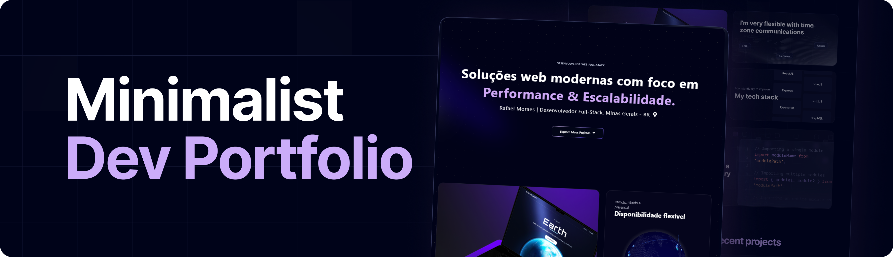

<div align="center">
  <br />
      
    </a>
  <br />

  <div>
    
    
    
    
  </div>

  <h3 align="center">Um Portfólio Moderno com Next.js</h3>

</div>

## 📋 Tabela de Conteúdos

1. 🤖 [Introdução](#introducao)
2. ⚙️ [Tecnologias Utilizadas](#tecnologias-utilizadas)
3. 🔋 [Funcionalidades](#funcionalidades)
4. 🤸 [Início Rápido](#inicio-rapido)
5. 🕸️ [Códigos Úteis](#codigos-uteis)
6. 🔗 [Assets](#assets)


## 🤖 Introdução

Construído com Next.js para a interface do usuário, Three.js para renderização 3D, Framer Motion para animações elegantes e estilizado com TailwindCSS, este portfólio demonstra as habilidades do desenvolvedor de maneira única e impactante.

## ⚙️ Tecnologias Utilizadas

- Next.js
- Three.js
- Framer Motion
- Tailwind CSS

## 🔋 Funcionalidades

👉 **Hero**: Introdução cativante com efeito de destaque e fundo dinâmico.  
👉 **Bento Grid**: Layout moderno com informações pessoais utilizando técnicas de CSS avançadas.  
👉 **Elementos 3D**: Componentes interativos como um globo 3D estilo GitHub e efeitos em cartões.  
👉 **Depoimentos**: Seção dinâmica com depoimentos e conteúdo animado.  
👉 **Experiência Profissional**: Apresentação destacada do histórico profissional.  
👉 **Efeito em Canvas**: Uso criativo de canvas HTML5 para efeitos visuais impressionantes.  
👉 **Responsividade**: Totalmente adaptável a todos os dispositivos, garantindo boa experiência para qualquer usuário.  
...e muito mais, incluindo arquitetura de código e reusabilidade.

## 🤸 Início Rápido

**Pré-requisitos**

- [Git](https://git-scm.com/)
- [Node.js](https://nodejs.org/en)
- [npm](https://www.npmjs.com/)

**Clone o Repositório**

```bash
git clone https://github.com/Rafael01Gx/spotlight-portfolio
cd portfolio
```

**Instale as dependências**

```bash
npm install
```

**Inicie o Projeto**

```bash
npm run dev
```

Abra [http://localhost:3000](http://localhost:3000) no seu navegador.

## 🕸️ Códigos Úteis

<details>
<summary><code>data/index.ts</code></summary>

```typescript
export const navItems = [
    { name: "Sobre", link: "#about" },
    { name: "Projetos", link: "#projects" },
    { name: "Depoimentos", link: "#testimonials" },
    { name: "Contato", link: "#contact" },
];

export const gridItems = [
    {
        id: 1,
        title: "Comunicação clara, projetos alinhados!",
        description: "",
        className: "lg:col-span-3 md:col-span-6 md:row-span-4 lg:min-h-[60vh]",
        imgClassName: "w-full h-full",
        titleClassName: "justify-end",
        img: "/b1.svg",
        spareImg: "",
    },
    {
        id: 2,
        title: "Disponibilidade flexível",
        description: "Remoto, híbrido e presencial.",
        className: "lg:col-span-2 md:col-span-3 md:row-span-2",
        imgClassName: "",
        titleClassName: "justify-start",
        img: "",
        spareImg: "",
    },
    {
        id: 3,
        title: "Minhas Stacks",
        description: "Em constante desenvolvimento.",
        className: "lg:col-span-2 md:col-span-3 md:row-span-2",
        imgClassName: "",
        titleClassName: "justify-center",
        img: "",
        spareImg: "",
    },
    {
        id: 4,
        title: "Cada desafio é um convite para criar o extraordinário.",
        description: "",
        className: "lg:col-span-2 md:col-span-3 md:row-span-1",
        imgClassName: "",
        titleClassName: "justify-start",
        img: "/grid.svg",
        spareImg: "/b4.svg",
    },

    {
        id: 5,
        title: "Explorando Novas Soluções",
        description: "Em breve mais informações...",
        className: "md:col-span-3 md:row-span-2",
        imgClassName: "absolute right-0 bottom-0 md:w-96 w-60",
        titleClassName: "justify-center md:justify-start lg:justify-center",
        img: "/b5.svg",
        spareImg: "/grid.svg",
    },
    {
        id: 6,
        title: "Pronto para o Próximo Passo?",
        description: "",
        className: "lg:col-span-2 md:col-span-3 md:row-span-1",
        imgClassName: "",
        titleClassName: "justify-center md:max-w-full max-w-60 text-center",
        img: "",
        spareImg: "",
    },
];

export const projects = [
    {
        id: 1,
        title: "AI Resume Analyzer",
        des: "Este projeto é uma aplicação web que permite analisar currículos com o apoio de inteligência artificial.Fornece feedbacks personalizados e pontuações ATS",
        img: "/p1.png",
        iconLists: ["/angular.svg", "/tail.svg", "/ts.svg","/git.svg"],
        link: "https://github.com/Rafael01Gx/resume-analyzer-ai",
    },
    {
        id: 2,
        title: "Award-Inspired Website",
        des: "Esse projeto é uma recriação interativa de um site no estilo Awwwards.",
        img: "/p2.png",
        iconLists: ["/angular.svg", "/tail.svg", "/ts.svg", "/gsap.svg", "/git.svg"],
        link: "https://github.com/Rafael01Gx/gsap_Awwwards",
    },
    {
        id: 3,
        title: "Movie App - Plix",
        des: "Aplicativo React Native/EXPO para Descoberta de Filmes com Busca Avançada.",
        img: "/p3.png",
        iconLists: ["/re.svg", "/tail.svg", "/ts.svg", "/app.svg"],
        link: "https://github.com/Rafael01Gx/react-native-playground",
    },
    {
        id: 4,
        title: "Lab Api Rest",
        des: "Esta API REST foi desenvolvida utilizando o framework NestJS e oferece uma solução robusta para aplicações web modernas. A aplicação conta com autenticação baseada em níveis de usuário, integração com banco de dados através do Prisma ORM e uma arquitetura bem estruturada seguindo os princípios do NestJS.",
        img: "/p4.png",
        iconLists: ["/nest.js.svg", "/ts.svg", "/mysql.svg", "/mongoDB.svg"],
        link: "https://github.com/Rafael01Gx/nest-lab-api",
    },
    {
        id: 5,
        title: "Web Lab",
        des: "Sistema web para gerenciamento de ordens de serviço e fluxo de amostras em um laboratório físico.",
        img: "/p6.png",
        iconLists: ["/angular.svg", "/ts.svg", "/git.svg", "/dock.svg"],
        link: "https://github.com/Rafael01Gx/angular-lab-web",
    },

];

export const testimonials = [
    {
        quote:
            "Esta seção será dedicada a relatos reais de clientes com quem tive o prazer de colaborar. Aqui, compartilho os resultados e aprendizados que construímos juntos.",
        name: "Depoimentos futuros",
        title: "Clientes e parceiros",
    },
    {
        quote:
            "Cada projeto traz novos desafios e conquistas. Após a entrega, os clientes poderão deixar aqui seu feedback — ajudando outras pessoas a conhecerem meu trabalho.",
        name: "Espaço reservado para você",
        title: "Depoimento profissional",
    },
    {
        quote:
            "Esta área está sendo preparada para mostrar a confiança e a satisfação dos parceiros que acreditaram no meu trabalho. Que tal escrever a próxima história comigo?",
        name: "Próximo cliente satisfeito",
        title: "Experiência em destaque",
    },
];


export const companies = [
    {
        id: 1,
        name: "cloudinary",
        img: "/cloud.svg",
        nameImg: "/cloudName.svg",
    },
    {
        id: 2,
        name: "appwrite",
        img: "/app.svg",
        nameImg: "/appName.svg",
    },
    {
        id: 3,
        name: "HOSTINGER",
        img: "/host.svg",
        nameImg: "/hostName.svg",
    },
    {
        id: 4,
        name: "stream",
        img: "/s.svg",
        nameImg: "/streamName.svg",
    },
    {
        id: 5,
        name: "docker.",
        img: "/dock.svg",
        nameImg: "/dockerName.svg",
    },
];

export const workExperience = [
    {
        id: 1,
        title: "Desenvolvedor Front-end (Estágio)",
        desc: "Atuei no desenvolvimento de interfaces responsivas com Angular e TailwindCSS, contribuindo na entrega de componentes reutilizáveis e otimizados para SEO.",
        className: "md:col-span-2",
        thumbnail: "/exp1.svg",
    },
    {
        id: 2,
        title: "Desenvolvedor Mobile - Playground",
        desc: "Participei da criação de um app mobile com React Native e Expo, entregando funcionalidades nativas e responsivas para Android e iOS.",
        className: "md:col-span-2",
        thumbnail: "/exp2.svg",
    },
    {
        id: 3,
        title: "Projeto Freelance - App Delivery",
        desc: "Desenvolvi uma aplicação full-stack para delivery local, utilizando NestJS, Firebase e Angular, com autenticação, pedidos em tempo real e painel administrativo.",
        className: "md:col-span-2",
        thumbnail: "/exp3.svg",
    },
    {
        id: 4,
        title: "Desenvolvedor Front-end (Projeto Pessoal)",
        desc: "Liderei a construção de um sistema de gestão com Angular 20, SSR, e backend em NestJS com Prisma e MySQL, focando em performance e boas práticas.",
        className: "md:col-span-2",
        thumbnail: "/exp4.svg",
    },
];


export const socialMedia = [
    {
        id: 1,
        img: "/git.svg",
        link: "https://github.com/Rafael01Gx",
    },
    {
        id: 2,
        img: "/link.svg",
        link: "https://www.linkedin.com/in/rafael-moraes-dev/",
    },
    {
        id: 3,
        img: "/insta.svg",
        link: "https://www.instagram.com/rafaelmoraes.dev/",
    },
];
```

</details>

<details>
<summary><code>tailwind.config.ts</code></summary>

```ts
import type { Config } from "tailwindcss";

const svgToDataUri = require("mini-svg-data-uri");

const colors = require("tailwindcss/colors");
const {
  default: flattenColorPalette,
} = require("tailwindcss/lib/util/flattenColorPalette");

const config = {
  darkMode: ["class"],
  content: [
    "./pages/**/*.{ts,tsx}",
    "./components/**/*.{ts,tsx}",
    "./app/**/*.{ts,tsx}",
    "./src/**/*.{ts,tsx}",
    "./data/**/*.{ts,tsx}",
  ],
  prefix: "",
  theme: {
    container: {
      center: true,
      padding: "2rem",
      screens: {
        "2xl": "1400px",
      },
    },
    extend: {
      colors: {
        black: {
          DEFAULT: "#000",
          100: "#000319",
          200: "rgba(17, 25, 40, 0.75)",
          300: "rgba(255, 255, 255, 0.125)",
        },
        white: {
          DEFAULT: "#FFF",
          100: "#BEC1DD",
          200: "#C1C2D3",
        },
        blue: {
          "100": "#E4ECFF",
        },
        purple: "#CBACF9",
        border: "hsl(var(--border))",
        input: "hsl(var(--input))",
        ring: "hsl(var(--ring))",
        background: "hsl(var(--background))",
        foreground: "hsl(var(--foreground))",
        primary: {
          DEFAULT: "hsl(var(--primary))",
          foreground: "hsl(var(--primary-foreground))",
        },
        secondary: {
          DEFAULT: "hsl(var(--secondary))",
          foreground: "hsl(var(--secondary-foreground))",
        },
        destructive: {
          DEFAULT: "hsl(var(--destructive))",
          foreground: "hsl(var(--destructive-foreground))",
        },
        muted: {
          DEFAULT: "hsl(var(--muted))",
          foreground: "hsl(var(--muted-foreground))",
        },
        accent: {
          DEFAULT: "hsl(var(--accent))",
          foreground: "hsl(var(--accent-foreground))",
        },
        popover: {
          DEFAULT: "hsl(var(--popover))",
          foreground: "hsl(var(--popover-foreground))",
        },
        card: {
          DEFAULT: "hsl(var(--card))",
          foreground: "hsl(var(--card-foreground))",
        },
      },
      borderRadius: {
        lg: "var(--radius)",
        md: "calc(var(--radius) - 2px)",
        sm: "calc(var(--radius) - 4px)",
      },
      keyframes: {
        "accordion-down": {
          from: { height: "0" },
          to: { height: "var(--radix-accordion-content-height)" },
        },
        "accordion-up": {
          from: { height: "var(--radix-accordion-content-height)" },
          to: { height: "0" },
        },
        spotlight: {
          "0%": {
            opacity: "0",
            transform: "translate(-72%, -62%) scale(0.5)",
          },
          "100%": {
            opacity: "1",
            transform: "translate(-50%,-40%) scale(1)",
          },
        },
        shimmer: {
          from: {
            backgroundPosition: "0 0",
          },
          to: {
            backgroundPosition: "-200% 0",
          },
        },
        moveHorizontal: {
          "0%": {
            transform: "translateX(-50%) translateY(-10%)",
          },
          "50%": {
            transform: "translateX(50%) translateY(10%)",
          },
          "100%": {
            transform: "translateX(-50%) translateY(-10%)",
          },
        },
        moveInCircle: {
          "0%": {
            transform: "rotate(0deg)",
          },
          "50%": {
            transform: "rotate(180deg)",
          },
          "100%": {
            transform: "rotate(360deg)",
          },
        },
        moveVertical: {
          "0%": {
            transform: "translateY(-50%)",
          },
          "50%": {
            transform: "translateY(50%)",
          },
          "100%": {
            transform: "translateY(-50%)",
          },
        },
        scroll: {
          to: {
            transform: "translate(calc(-50% - 0.5rem))",
          },
        },
      },
      animation: {
        "accordion-down": "accordion-down 0.2s ease-out",
        "accordion-up": "accordion-up 0.2s ease-out",
        spotlight: "spotlight 2s ease .75s 1 forwards",
        shimmer: "shimmer 2s linear infinite",
        first: "moveVertical 30s ease infinite",
        second: "moveInCircle 20s reverse infinite",
        third: "moveInCircle 40s linear infinite",
        fourth: "moveHorizontal 40s ease infinite",
        fifth: "moveInCircle 20s ease infinite",
        scroll:
          "scroll var(--animation-duration, 40s) var(--animation-direction, forwards) linear infinite",
      },
    },
  },
  plugins: [
    require("tailwindcss-animate"),
    addVariablesForColors,
    function ({ matchUtilities, theme }: any) {
      matchUtilities(
        {
          "bg-grid": (value: any) => ({
            backgroundImage: `url("${svgToDataUri(
              `<svg xmlns="http://www.w3.org/2000/svg" viewBox="0 0 32 32" width="100" height="100" fill="none" stroke="${value}"><path d="M0 .5H31.5V32"/></svg>`
            )}")`,
          }),
          "bg-grid-small": (value: any) => ({
            backgroundImage: `url("${svgToDataUri(
              `<svg xmlns="http://www.w3.org/2000/svg" viewBox="0 0 32 32" width="8" height="8" fill="none" stroke="${value}"><path d="M0 .5H31.5V32"/></svg>`
            )}")`,
          }),
          "bg-dot": (value: any) => ({
            backgroundImage: `url("${svgToDataUri(
              `<svg xmlns="http://www.w3.org/2000/svg" viewBox="0 0 32 32" width="16" height="16" fill="none"><circle fill="${value}" id="pattern-circle" cx="10" cy="10" r="1.6257413380501518"></circle></svg>`
            )}")`,
          }),
        },
        { values: flattenColorPalette(theme("backgroundColor")), type: "color" }
      );
    },
  ],
} satisfies Config;

function addVariablesForColors({ addBase, theme }: any) {
  let allColors = flattenColorPalette(theme("colors"));
  let newVars = Object.fromEntries(
    Object.entries(allColors).map(([key, val]) => [`--${key}`, val])
  );

  addBase({
    ":root": newVars,
  });
}

export default config;
```

</details>

<details>
<summary><code>globals.css</code></summary>

```css
@tailwind base;
@tailwind components;
@tailwind utilities;

@layer base {
  :root {
    --background: 0 0% 100%;
    --foreground: 240 10% 3.9%;

    --card: 0 0% 100%;
    --card-foreground: 240 10% 3.9%;

    --popover: 0 0% 100%;
    --popover-foreground: 240 10% 3.9%;

    --primary: 240 5.9% 10%;
    --primary-foreground: 0 0% 98%;

    --secondary: 240 4.8% 95.9%;
    --secondary-foreground: 240 5.9% 10%;

    --muted: 240 4.8% 95.9%;
    --muted-foreground: 240 3.8% 46.1%;

    --accent: 240 4.8% 95.9%;
    --accent-foreground: 240 5.9% 10%;

    --destructive: 0 84.2% 60.2%;
    --destructive-foreground: 0 0% 98%;

    --border: 240 5.9% 90%;
    --input: 240 5.9% 90%;
    --ring: 240 10% 3.9%;

    --radius: 0.5rem;
  }

  .dark {
    --background: 240 10% 3.9%;
    --foreground: 0 0% 98%;

    --card: 240 10% 3.9%;
    --card-foreground: 0 0% 98%;

    --popover: 240 10% 3.9%;
    --popover-foreground: 0 0% 98%;

    --primary: 0 0% 98%;
    --primary-foreground: 240 5.9% 10%;

    --secondary: 240 3.7% 15.9%;
    --secondary-foreground: 0 0% 98%;

    --muted: 240 3.7% 15.9%;
    --muted-foreground: 240 5% 64.9%;

    --accent: 240 3.7% 15.9%;
    --accent-foreground: 0 0% 98%;

    --destructive: 0 62.8% 30.6%;
    --destructive-foreground: 0 0% 98%;

    --border: 240 3.7% 15.9%;
    --input: 240 3.7% 15.9%;
    --ring: 240 4.9% 83.9%;
  }
}

@layer base {
  * {
    @apply border-border !scroll-smooth;
  }
  body {
    @apply bg-background text-foreground;
  }
  button {
    @apply active:outline-none;
  }
}

@layer utilities {
  .heading {
    @apply font-bold text-4xl md:text-5xl text-center;
  }

  .black-gradient {
    background: linear-gradient(90deg, #161a31 0%, #06091f 100%);
  }
}
```

</details>


<details>
<summary><code>Linear Gradient</code></summary>

```js
style={{
        //   add these two
        //   you can generate the color from here https://cssgradient.io/
        background: "rgb(4,7,29)",
        backgroundColor:
          "linear-gradient(90deg, rgba(4,7,29,1) 0%, rgba(12,14,35,1) 100%)",
      }}
```
</details>

## 🔗 Assets

Os recursos utilizados neste projeto estão disponíveis [aqui](https://github.com/Rafael01Gx/spotlight-portfolio/tree/master/public)


